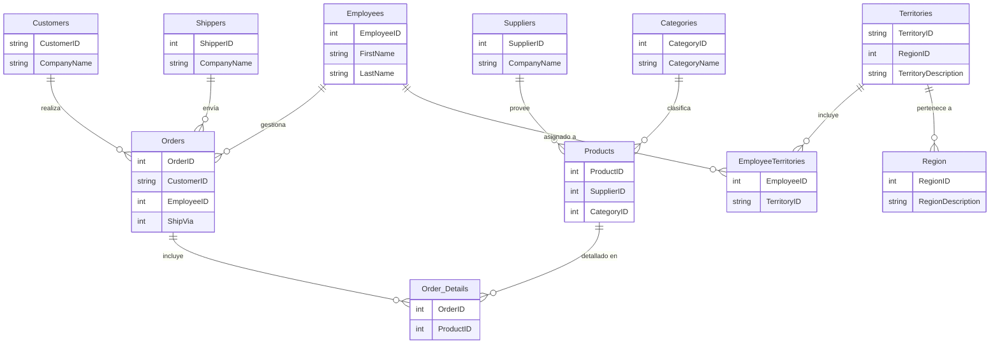

# Diagrama de la Base de Datos

```mermaid
erDiagram
    Customers ||--o{ Orders : "realiza"
    Employees ||--o{ Orders : "gestiona"
    Shippers ||--o{ Orders : "envía"
    Orders ||--o{ Order_Details : "incluye"
    Products ||--o{ Order_Details : "detallado en"
    Suppliers ||--o{ Products : "provee"
    Categories ||--o{ Products : "clasifica"
    Employees ||--o{ EmployeeTerritories : "asignado a"
    Territories ||--o{ EmployeeTerritories : "incluye"
    Territories ||--o{ Region : "pertenece a"

    Customers {
        string CustomerID
        string CompanyName
        %% Otros campos
    }
    Employees {
        int EmployeeID
        string FirstName
        string LastName
        %% Otros campos
    }
    Shippers {
        int ShipperID
        string CompanyName
        %% Otros campos
    }
    Orders {
        int OrderID
        string CustomerID
        int EmployeeID
        int ShipVia
        %% Otros campos
    }
    Order_Details {
        int OrderID
        int ProductID
        %% Otros campos
    }
    Products {
        int ProductID
        int SupplierID
        int CategoryID
        %% Otros campos
    }
    Suppliers {
        int SupplierID
        string CompanyName
        %% Otros campos
    }
    Categories {
        int CategoryID
        string CategoryName
        %% Otros campos
    }
    EmployeeTerritories {
        int EmployeeID
        string TerritoryID
    }
    Territories {
        string TerritoryID
        int RegionID
        string TerritoryDescription
    }
    Region {
        int RegionID
        string RegionDescription
    }
```

> Este diagrama representa las tablas principales y sus relaciones en la base de datos, usando la notación Mermaid ER.
